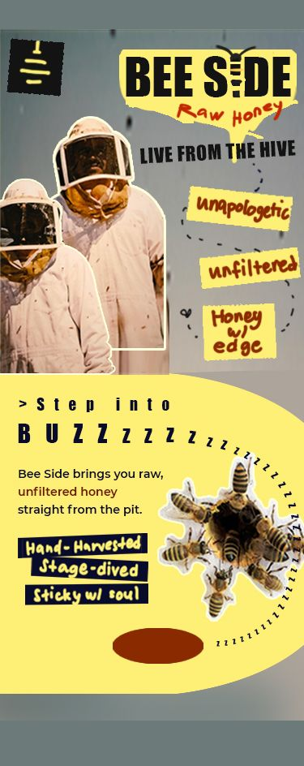
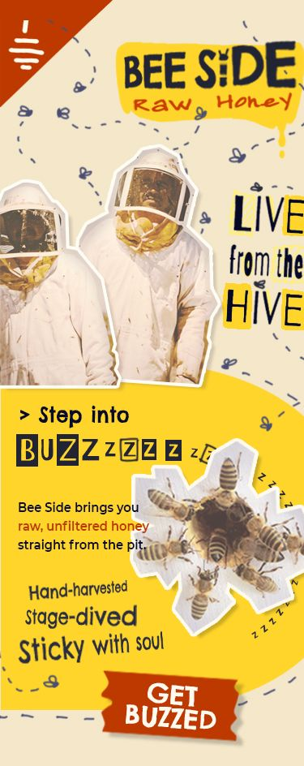
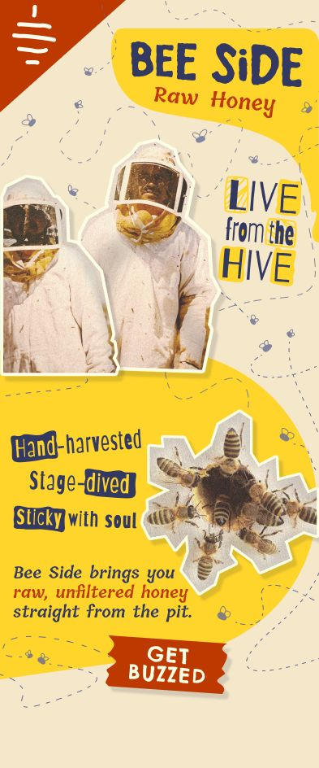

# 🐝🍯 Project Title: Bee Side

## 📄 Description

A honey-themed landing page with a rock concert aesthetic — a creative exploration of visual storytelling through design and layout.

> **📸 Image Disclaimer**  
> *I do not own the rights to all images or illustrations used in this project. They are included strictly for educational and demonstration purposes. All image credits go to the original creators: [WeStarMoney Rec on Pexels](https://www.pexels.com/@westarmoney)*

## 💡 What I Learned

### 🛠️ Technology & Design

- Leveraging Figma's design tokens and custom variables for consistency  
- Understanding the strengths and limits of Photoshop, Illustrator, and Figma  
- Starting rough sketches in raster (Photoshop), refining in vector (Illustrator)  
- Using Illustrator for advanced text treatments (e.g. text on path, warping)  
- Incorporating external CSS libraries and generators to accelerate layout development

### 🧱 HTML

- Using CSS-generated shapes instead of image imports for better performance  
- Writing cleaner, more semantic HTML structure  

### 🎨 CSS

- Applying `position: relative` and `absolute` for layout control  
- Creative use of `clip-path` and `border-radius` for custom shapes  
- Font scaling with `clamp()` for responsive typography  
- Managing `object-fit` behaviors with SVG and image content  
- Styling with pseudo-elements (`::before`, `::after`) for visual accents  
- Keeping selector nesting shallow and efficient  
- Recognizing the value of design-code balance and when to simplify

## 📸 Preview

  

    
<strong>Sketch</strong>

    
  

  

    
<strong>Refine</strong>

    
  

  

    
<strong>Adapt</strong>

    
  

## 🔗 Live Demo

- [Figma Design](https://www.figma.com/design/wxIlIEUMimOsJGlVPh7zXS/Bee-Side?m=auto&t=6PYGkzoQlVAESRJ9-1)  
- [CodePen Demo](https://your-codepen-link)  
- [GitHub Pages (if hosted)](https://github.com/Z-Cormbip/Generated_Random_Projects/tree/02778a8cc7f8417e2b3ca2fb55b0a9158211c726/Bee_Side)

## 🚧 Challenges

- Maintaining responsiveness in a visually complex layout  
- Balancing time and energy between high-fidelity design and detailed code  
- Controlling layout overflow caused by clipped and shaped elements

## 🧠 Next Steps

- Focus on simpler, more maintainable design-to-code workflows  
- Build more projects using random creative prompts  
- Begin exploring JavaScript for interactivity and behavior
