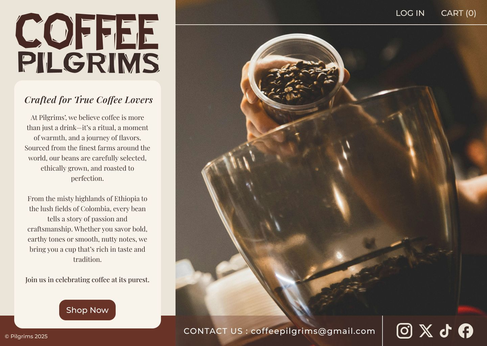

# ☕ Project Title: Coffee Pilgrims

## 📄 Description

A coffee-themed, minimalist layout — my first attempt at building a webpage using HTML and CSS.

> **📸 Image Disclaimer**  
> *I do not own the rights to all images or illustrations used in this project. They are included strictly for educational and demonstration purposes. All image credits go to the original creators: [@cihanyuce on Pexels](https://www.pexels.com/@cihanyuce)*

## 💡 What I Learned

### 🛠 Technology & Design

- Figma for layout design and prototyping  
- Google Fonts to embed typefaces  
- TinyPNG / Figma plugins for image compression  
- Coolors & Figma plugins for color contrast and palette exploration  

### 🧱 HTML

- Structuring for readability  
- Understanding parent, child, sibling, and descendant relationships  

### 🎨 CSS

- `box-sizing: border-box` to control sizing  
- Setting up global styles early  
- Flexbox for 1D layout, Grid for 2D  
- Using `:hover` and `::after` pseudo-classes  
- Positioning with `position` and `transform`  
- Testing unit types like `em`, `rem`, and `%`

## 📸 Preview

## 🔗 Live Demo

- [Figma Design](https://www.figma.com/design/92VIakhv5NP5rtJ92STM2i/Coffee---Whiskey?m=auto&t=6PYGkzoQlVAESRJ9-1)  
- [CodePen Demo](https://your-codepen-link)  
- [GitHub Pages (if hosted)](https://your-github-pages-link)

## 🚧 Challenges

- Translating a layout from design to functional CSS  
- Deciding where to nest layout-specific styles  
- Balancing padding and margin for clean spacing

## 🧠 Next Steps

- Responsive layout design  
- Strengthening visual hierarchy  
- Completing a full landing page