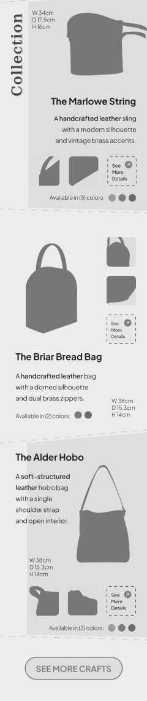

# 🪶 Ironleaf Atelier

*Ironleaf Atelier* is a fictional leather craft brand concept that blends design principles with modern web development practices.

This project demonstrates my learning in UI integration, Next.js optimization, and design execution.

> **📸 Image Disclaimer**  
> *I do not own the rights to all images or illustrations used in this project. They are included strictly for educational and demonstration purposes. All image credits go to the original creators: [Soul Flower Co.](https://soulflower.co/)*

## 🧠 What I Learned

### ⚡ Next.js

- Gained a clear understanding of **Client-Side (CSR)** vs **Server-Side Rendering (SSR)** — their advantages, limitations, and proper use cases.
- Used the "use client" directive to enable interactivity and state management for client-only components.
- Explored **Next.js file-based routing**, learning how folders translate directly to URL paths and how to create **nested or dynamic routes** (e.g., filters and pagination).
- Utilized the `<Link>` component for seamless navigation and the `<Image>` component for automatic WebP optimization and improved performance.
- Experimented with API routes and Zod validation to handle backend logic and data integrity.

### 🧩 UI Component libraries

- Integrated **DaisyUI** components into my TailwindCSS workflow to speed up development while maintaining design control.
- Learned how to **customize and override** pre-styled components through Tailwind directives and theme tokens.

### ⚛️ Design Fundamentals

- Studied visual design principles — focusing on **shape, closure, leading lines, negative space, contrast, and hierarchy** — to build more intentional layouts.
- Applied these fundamentals throughout the site for better flow and readability.
- 🧾 View the detailed [Case Study](casestudylink)

## 📸 Preview

> *Screenshots are optimized for web display. For sharper details, please view the Live Demo or Figma Design.*

  
  
  
  

  
  
  
  

## 🔗 Live Demo

- 🎨 [Figma Design](https://www.figma.com/design/zXXpnTWtRyNBBioVuqF7iP/Ironleaf-Atelier?m=auto&t=6kEOUDEUULkLZKBB-6)

## 🔭 Next Steps

- Build a personal portfolio that showcases my growth in **frontend development and design integration.**
- Explore ways to merge my **illustration and animation** background into interactive web experiences.