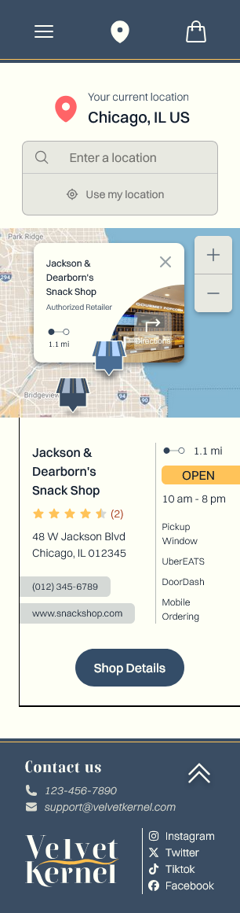

# 🧪 Refactoring *Velvet Kernel* into React

This project is a full refactor of my original *Velvet Kernel* popcorn website, redesigned using **React**, **TypeScript**, and **Tailwind CSS**. The goal was to modernize the structure with reusable components, introduce strong typing with TypeScript, and adopt a utility-first CSS approach for maintainable styling.

Along the way, I explored concepts like React hooks, form validation with `zod`, modular design patterns, and the benefits of scalable frontend frameworks.

> **📸 Image Disclaimer**  
> *I do not own the rights to all images or illustrations used in this project. They are included strictly for educational and demonstration purposes. All image credits go to the original creators: [Garrett Popcorn Co.](www.garrettpopcorn.com)*

## 🧠 What I Learned

### ⚙️ Tailwind CSS
- Adopted **Tailwind CSS** for utility-first, rapid styling.
- Used directives like `@apply`, `@theme`, and `@variant` for managing design tokens and reusability.
- Explored advanced pseudo-classes like `group-hover`, `peer-focus`, and logical negation via `:not()` and `:has()`.

### 🔤 TypeScript
- Introduced **TypeScript** to catch type-related bugs early and enforce clarity in data structure.
- Defined props with `interface` to safely manage component input.

### ⚛️ React.js
- Built the UI using **modular React components** to enable reusability and separation of concerns.
- Passed and validated component props with consistent typing.
- Used **React Hooks** (`useState`, `useEffect`, etc.) for managing stateful behavior.
- Integrated third-party libraries like `react-icons` for visual assets and `react-router` for page navigation.
- Implemented **form validation** with `react-hook-form` and `zod`.
- Tried out **Vitest** for fast unit testing and component-level test cases.

## 📸 Preview

  
  
  

## 🔗 Live Demo

- 🎨 [Figma Design](https://www.figma.com/design/RJBbMxvZJcGmynEvpVQLz1/Popcorn_Project?m=auto&t=ekOGfjJ1hZSuXUR5-1)

## 🚧 Challenges Faced

- Translating concepts from vanilla JS into React logic.
- Knowing when to reach for hooks like `useEffect` or `useForm`.
- Navigating TypeScript’s strict typing alongside rapidly changing UI logic.

## 🔭 Next Steps

- Explore **Next.js** for file-based routing, server-side rendering (SSR), and scalable frontend architecture.
- Refactor API calls and consider integrating backend logic for store search.
